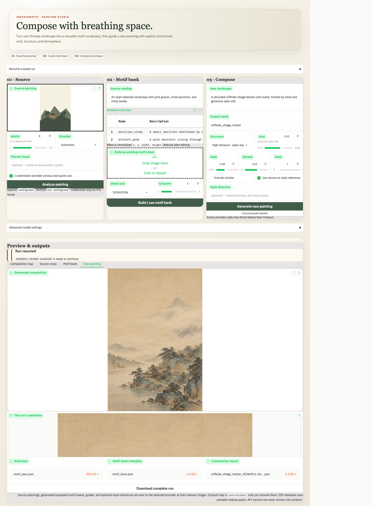

# inkvoidmotif

inkvoidmotif analyzes a Chinese landscape, turns a reviewed motif plan into a reusable motif bank, and composes a new painting with explicit void and landmass control. The Gradio Studio is the end-user workflow; the CLI exposes the same pipeline plus detailed ink-ratio tools.



New users can start with the [five-minute quickstart](QUICKSTART.md).

## Install

Python 3.10 or newer is required.

In the full research repository, enter the package directory first:

```bash
cd inkvoidmotif
```

```bash
python3 -m venv .venv
source .venv/bin/activate
python -m pip install --upgrade pip
python -m pip install -e .
cp .env.example .env
```

Add at least one provider key to `.env`. NVIDIA and OpenAI are supported. Keep `.env` private.

To install a built wheel instead of an editable checkout:

```bash
python -m pip install inkvoidmotif-0.1.0-py3-none-any.whl
```

## Gradio Studio

```bash
source .venv/bin/activate
inkvoidmotif-studio
```

Alternatively:

```bash
PYTHONPATH=src python app.py
```

Open [http://127.0.0.1:7860](http://127.0.0.1:7860). The reviewed workflow is:

1. Upload a painting and create an editable motif plan.
2. Generate a motif sheet, or import an existing sheet, then review its sliced cells.
3. Preview the exact production composition map and generate a unified landscape from the individual bank assets.
4. Compare the requested and measured region-based void ratios, inspect the occupancy preview, and download a portable run ZIP.

Editing the motif table or choosing a different sheet invalidates the active bank. Rebuild the bank before composing. Each bank and composition attempt receives a unique artifact path, so retries do not overwrite earlier evidence. Local runs can be resumed after a refresh from **Resume a saved run**.

### Provider data, quota, and cancellation

Planning, motif-sheet generation, and painting composition are separate provider calls. An imported motif sheet skips only the sheet-generation call. The UI requires acknowledgement before billable calls.

- Planning sends the normalized source painting and planning instructions.
- Sheet generation sends the normalized source and motif plan prompt.
- Composition sends the layout guide, individual motif-bank cells, and the source painting only if the style-reference option is enabled.
- Credentials remain server-side and are not written to artifacts.
- **Cancel queued request** removes queued work. A synchronous provider call already in progress may finish before the configured timeout.

Runs remain under `runs/studio/` until you remove them. Gradio upload-cache files are cleaned automatically. Saved-run browsing is disabled when the server is shared or bound beyond loopback; the app is not a multi-tenant service.

The server binds to loopback by default. A share link or non-loopback bind is refused unless both authentication variables are configured:

```bash
export INKVOIDMOTIF_STUDIO_USER=collaborator
export INKVOIDMOTIF_STUDIO_PASSWORD='choose-a-long-random-password'
inkvoidmotif-studio --share
```

## Provider configuration

The NVIDIA default uses its Responses API with an `image_generation` tool. Base URLs ending in `/v1`, `/responses`, or `/chat/completions` are normalized automatically. OpenAI defaults to `gpt-5.5` for planning and `gpt-image-2` for images. See `.env.example` for all overrides, timeouts, retry limits, and storage settings.

Shell environment variables take precedence over `.env`. `INKVOIDMOTIF_PROVIDER` selects the automatic provider when both keys are available.

## CLI

Inspect all commands with:

```bash
inkvoidmotif --help
```

Useful examples:

```bash
# Analyze a source painting.
inkvoidmotif plan --source painting.jpg --out runs/example --count 8

# Import a reviewed motif sheet; slices retain their paper background by default.
inkvoidmotif import-bank --sheet motif_sheet.png --plan runs/example/motif_plan.json --out runs/example

# Optionally flood-fill the sheet background to transparency.
inkvoidmotif import-bank --sheet motif_sheet.png --plan runs/example/motif_plan.json --out runs/example --remove-background

# Preview a 62% void composition without a provider call.
inkvoidmotif layout --bank runs/example/motif_bank.json --out runs/example/painting.png \
  --theme "autumn river valley with mist" --void 0.62 --preview-only

# Generate the painting with the same layout controls.
inkvoidmotif layout --bank runs/example/motif_bank.json --out runs/example/painting.png \
  --theme "autumn river valley with mist" --void 0.62 --spread 0.6

# Measure three-band ink balance.
inkvoidmotif ink-measure --image runs/example/painting.png
```

The `layout` command writes the composition map, clean conditioning guide, output, prompt, occupancy visualization, and a `.layout_report.json` containing the pipeline's region-based void measurement.

## Development and audit

```bash
python -m pip install -e '.[dev]'
python -m unittest discover -s tests -v
ruff check src tests app.py
ruff format --check src tests app.py
bandit -q -r src
pip-audit
python -m build
```

Tests replace every provider call with local fakes. They do not consume model quota.

## Package structure

- `src/inkvoidmotif/studio.py` coordinates run state, validation, and saved artifacts.
- `src/inkvoidmotif/gradio_app.py` contains callbacks, event wiring, and launch policy.
- `src/inkvoidmotif/gui_layout.py` defines the Gradio component tree.
- `src/inkvoidmotif/gui_theme.py` contains visual styling and browser accessibility helpers.
- `src/inkvoidmotif/pipeline.py` and `src/inkvoidmotif/layout.py` implement the model pipeline.
- `tests/test_studio.py` exercises the GUI contract and pipeline with fake providers.

## Build a release bundle

Run the full audit above, then build both standard Python distribution formats:

```bash
python -m build
python -m pip install --force-reinstall --no-deps dist/inkvoidmotif-0.1.0-py3-none-any.whl
python -m pip check
```

Share the wheel and source archive from `dist/`. The source archive includes this
README, the quickstart guide, the example environment file, and the anonymous-review
license notice. Do not include `.env` or `runs/` in a release. Restore the final
rights-holder and licensing information only after anonymous review has ended.
